# TripCentral — Sequence Diagrams

## Rendering Instructions

The diagrams below use **Mermaid** `sequenceDiagram` syntax, which is natively
supported by **Creately** (Import → Mermaid).

**How to use in Creately:**

1. Open <https://creately.com> and create a new workspace.
2. Click **Import → Mermaid** (or paste directly into a Mermaid shape).
3. Copy any individual code block below and paste it.
4. Creately will render the sequence diagram automatically.

> **Tip:** Each use case is in its own fenced code block so you can import them
> one at a time or combine several into a single workspace.

---

## Table of Contents

### User Management & Socials
1. [Sign Up](#1-sign-up)
2. [Log In](#2-log-in)
3. [Verify Email](#3-verify-email)
4. [View / Edit Profile](#4-view--edit-profile)
5. [Search Users](#5-search-users)
6. [Accept / Reject Invitation](#6-accept--reject-invitation)
7. [Receive Notifications](#7-receive-notifications)

### Mapping & Lists
8. [Search Locations (Google Maps)](#8-search-locations-google-maps)
9. [View Location Details](#9-view-location-details)
10. [Create List](#10-create-list)
11. [Delete List](#11-delete-list)
12. [Add Place to List](#12-add-place-to-list)
13. [Manage List Sections](#13-manage-list-sections)
14. [Reorder List Items](#14-reorder-list-items)

### Collaboration & Community
15. [Invite User to Collaborate](#15-invite-user-to-collaborate)
16. [Chat with Collaborators](#16-chat-with-collaborators)
17. [Propose Changes](#17-propose-changes)
18. [Approve / Reject Changes](#18-approve--reject-changes)
19. [Make List Public](#19-make-list-public)
20. [Browse Public Lists](#20-browse-public-lists)
21. [Rate a List](#21-rate-a-list)
22. [Submit Place Review](#22-submit-place-review)

---

## User Management & Socials

### 1. Sign Up

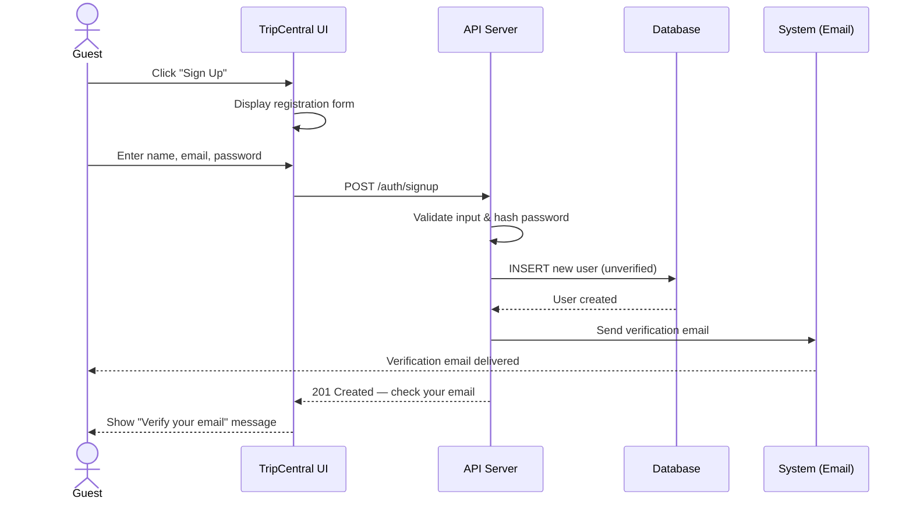
```mermaid
sequenceDiagram
    actor Guest
    participant UI as TripCentral UI
    participant API as API Server
    participant DB as Database
    participant System as System (Email)

    Guest->>UI: Click "Sign Up"
    UI->>UI: Display registration form
    Guest->>UI: Enter name, email, password
    UI->>API: POST /auth/signup
    API->>API: Validate input & hash password
    API->>DB: INSERT new user (unverified)
    DB-->>API: User created
    API->>System: Send verification email
    System-->>Guest: Verification email delivered
    API-->>UI: 201 Created — check your email
    UI-->>Guest: Show "Verify your email" message
```

---

### 2. Log In

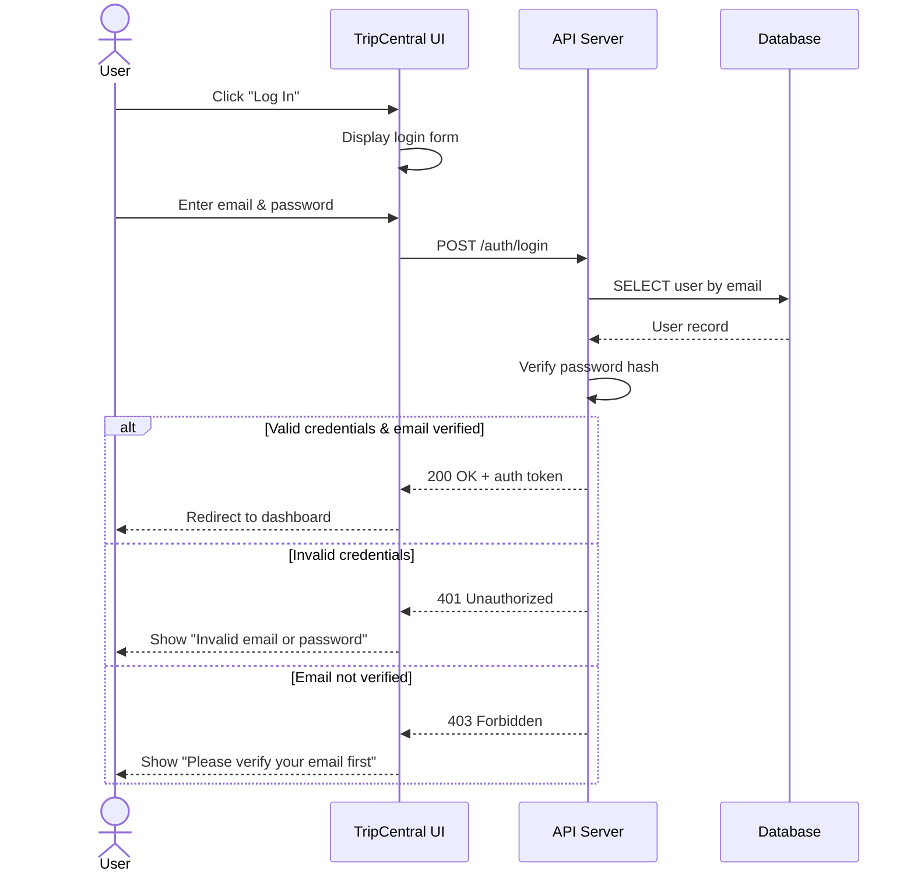
```mermaid
sequenceDiagram
    actor User
    participant UI as TripCentral UI
    participant API as API Server
    participant DB as Database

    User->>UI: Click "Log In"
    UI->>UI: Display login form
    User->>UI: Enter email & password
    UI->>API: POST /auth/login
    API->>DB: SELECT user by email
    DB-->>API: User record
    API->>API: Verify password hash
    alt Valid credentials & email verified
        API-->>UI: 200 OK + auth token
        UI-->>User: Redirect to dashboard
    else Invalid credentials
        API-->>UI: 401 Unauthorized
        UI-->>User: Show "Invalid email or password"
    else Email not verified
        API-->>UI: 403 Forbidden
        UI-->>User: Show "Please verify your email first"
    end
```

---

### 3. Verify Email

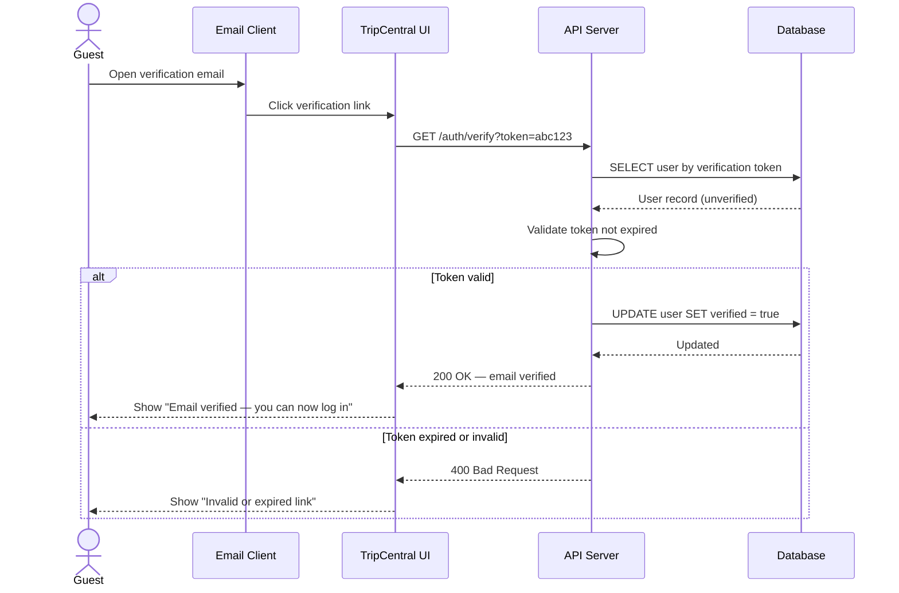
```mermaid
sequenceDiagram
    actor Guest
    participant Email as Email Client
    participant UI as TripCentral UI
    participant API as API Server
    participant DB as Database

    Guest->>Email: Open verification email
    Email->>UI: Click verification link
    UI->>API: GET /auth/verify?token=abc123
    API->>DB: SELECT user by verification token
    DB-->>API: User record (unverified)
    API->>API: Validate token not expired
    alt Token valid
        API->>DB: UPDATE user SET verified = true
        DB-->>API: Updated
        API-->>UI: 200 OK — email verified
        UI-->>Guest: Show "Email verified — you can now log in"
    else Token expired or invalid
        API-->>UI: 400 Bad Request
        UI-->>Guest: Show "Invalid or expired link"
    end
```

---

### 4. View / Edit Profile

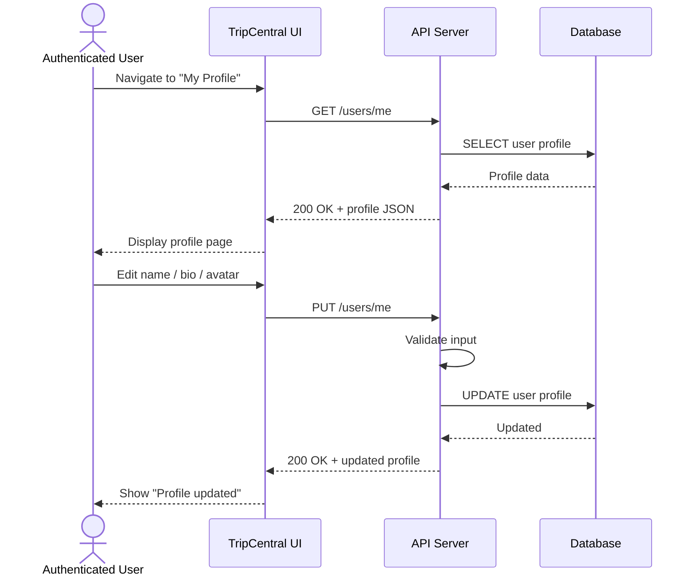
```mermaid
sequenceDiagram
    actor AuthUser as Authenticated User
    participant UI as TripCentral UI
    participant API as API Server
    participant DB as Database

    AuthUser->>UI: Navigate to "My Profile"
    UI->>API: GET /users/me
    API->>DB: SELECT user profile
    DB-->>API: Profile data
    API-->>UI: 200 OK + profile JSON
    UI-->>AuthUser: Display profile page

    AuthUser->>UI: Edit name / bio / avatar
    UI->>API: PUT /users/me
    API->>API: Validate input
    API->>DB: UPDATE user profile
    DB-->>API: Updated
    API-->>UI: 200 OK + updated profile
    UI-->>AuthUser: Show "Profile updated"
```

---

### 5. Search Users

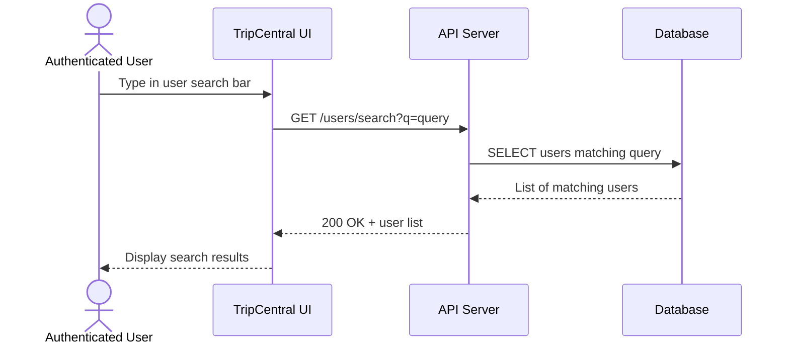
```mermaid
sequenceDiagram
    actor AuthUser as Authenticated User
    participant UI as TripCentral UI
    participant API as API Server
    participant DB as Database

    AuthUser->>UI: Type in user search bar
    UI->>API: GET /users/search?q=query
    API->>DB: SELECT users matching query
    DB-->>API: List of matching users
    API-->>UI: 200 OK + user list
    UI-->>AuthUser: Display search results
```

---

### 6. Accept / Reject Invitation

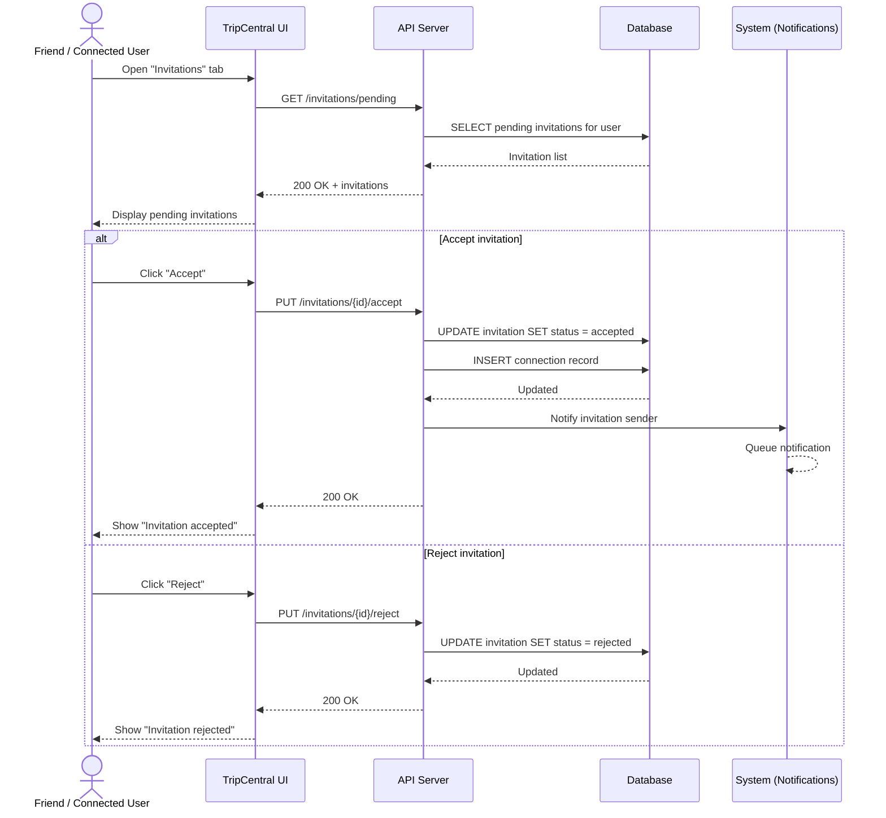
```mermaid
sequenceDiagram
    actor Friend as Friend / Connected User
    participant UI as TripCentral UI
    participant API as API Server
    participant DB as Database
    participant System as System (Notifications)

    Friend->>UI: Open "Invitations" tab
    UI->>API: GET /invitations/pending
    API->>DB: SELECT pending invitations for user
    DB-->>API: Invitation list
    API-->>UI: 200 OK + invitations
    UI-->>Friend: Display pending invitations

    alt Accept invitation
        Friend->>UI: Click "Accept"
        UI->>API: PUT /invitations/{id}/accept
        API->>DB: UPDATE invitation SET status = accepted
        API->>DB: INSERT connection record
        DB-->>API: Updated
        API->>System: Notify invitation sender
        System-->>System: Queue notification
        API-->>UI: 200 OK
        UI-->>Friend: Show "Invitation accepted"
    else Reject invitation
        Friend->>UI: Click "Reject"
        UI->>API: PUT /invitations/{id}/reject
        API->>DB: UPDATE invitation SET status = rejected
        DB-->>API: Updated
        API-->>UI: 200 OK
        UI-->>Friend: Show "Invitation rejected"
    end
```

---

### 7. Receive Notifications

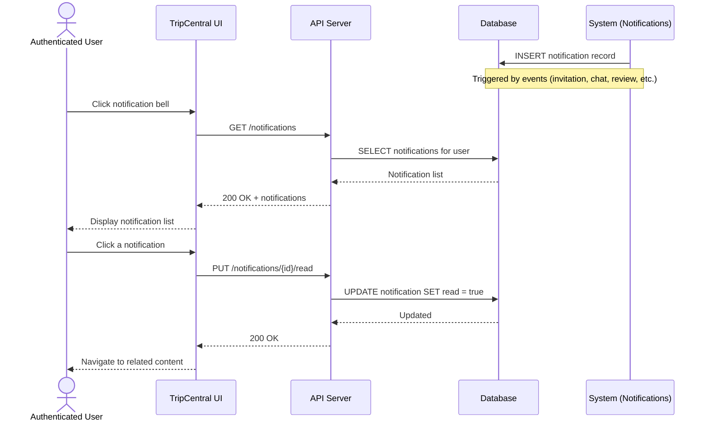
```mermaid
sequenceDiagram
    actor AuthUser as Authenticated User
    participant UI as TripCentral UI
    participant API as API Server
    participant DB as Database
    participant System as System (Notifications)

    System->>DB: INSERT notification record
    Note over System,DB: Triggered by events (invitation, chat, review, etc.)

    AuthUser->>UI: Click notification bell
    UI->>API: GET /notifications
    API->>DB: SELECT notifications for user
    DB-->>API: Notification list
    API-->>UI: 200 OK + notifications
    UI-->>AuthUser: Display notification list

    AuthUser->>UI: Click a notification
    UI->>API: PUT /notifications/{id}/read
    API->>DB: UPDATE notification SET read = true
    DB-->>API: Updated
    API-->>UI: 200 OK
    UI-->>AuthUser: Navigate to related content
```

---

## Mapping & Lists

### 8. Search Locations (Google Maps)

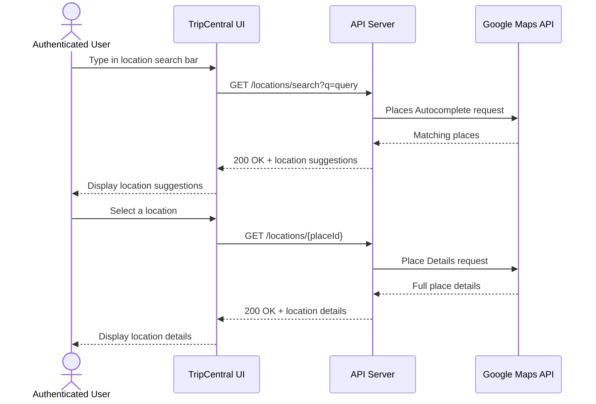
```mermaid
sequenceDiagram
    actor AuthUser as Authenticated User
    participant UI as TripCentral UI
    participant API as API Server
    participant GMaps as Google Maps API

    AuthUser->>UI: Type in location search bar
    UI->>API: GET /locations/search?q=query
    API->>GMaps: Places Autocomplete request
    GMaps-->>API: Matching places
    API-->>UI: 200 OK + location suggestions
    UI-->>AuthUser: Display location suggestions

    AuthUser->>UI: Select a location
    UI->>API: GET /locations/{placeId}
    API->>GMaps: Place Details request
    GMaps-->>API: Full place details
    API-->>UI: 200 OK + location details
    UI-->>AuthUser: Display location details
```

---

### 9. View Location Details

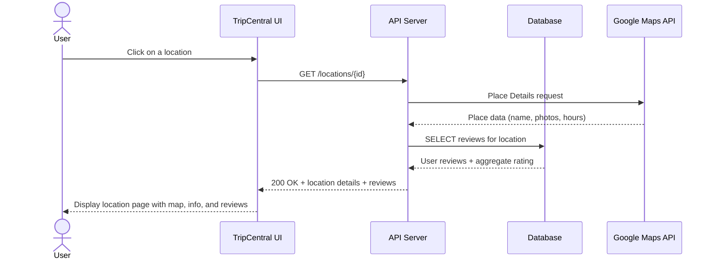
```mermaid
sequenceDiagram
    actor User
    participant UI as TripCentral UI
    participant API as API Server
    participant DB as Database
    participant GMaps as Google Maps API

    User->>UI: Click on a location
    UI->>API: GET /locations/{id}
    API->>GMaps: Place Details request
    GMaps-->>API: Place data (name, photos, hours)
    API->>DB: SELECT reviews for location
    DB-->>API: User reviews + aggregate rating
    API-->>UI: 200 OK + location details + reviews
    UI-->>User: Display location page with map, info, and reviews
```

---

### 10. Create List

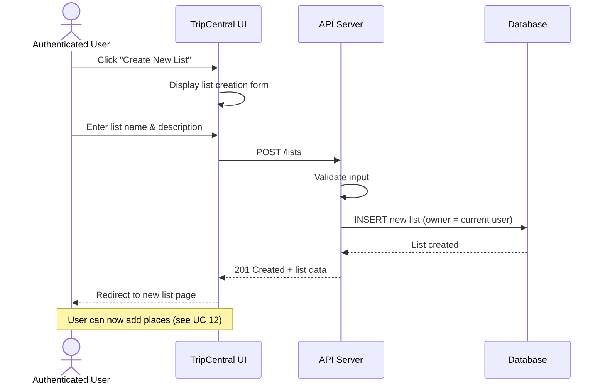
```mermaid
sequenceDiagram
    actor AuthUser as Authenticated User
    participant UI as TripCentral UI
    participant API as API Server
    participant DB as Database

    AuthUser->>UI: Click "Create New List"
    UI->>UI: Display list creation form
    AuthUser->>UI: Enter list name & description
    UI->>API: POST /lists
    API->>API: Validate input
    API->>DB: INSERT new list (owner = current user)
    DB-->>API: List created
    API-->>UI: 201 Created + list data
    UI-->>AuthUser: Redirect to new list page
    Note over AuthUser,UI: User can now add places (see UC 12)
```

---

### 11. Delete List

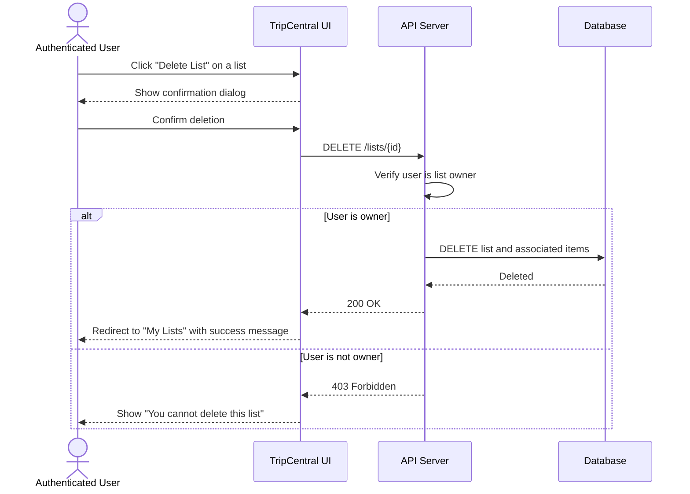
```mermaid
sequenceDiagram
    actor AuthUser as Authenticated User
    participant UI as TripCentral UI
    participant API as API Server
    participant DB as Database

    AuthUser->>UI: Click "Delete List" on a list
    UI-->>AuthUser: Show confirmation dialog
    AuthUser->>UI: Confirm deletion
    UI->>API: DELETE /lists/{id}
    API->>API: Verify user is list owner
    alt User is owner
        API->>DB: DELETE list and associated items
        DB-->>API: Deleted
        API-->>UI: 200 OK
        UI-->>AuthUser: Redirect to "My Lists" with success message
    else User is not owner
        API-->>UI: 403 Forbidden
        UI-->>AuthUser: Show "You cannot delete this list"
    end
```

---

### 12. Add Place to List

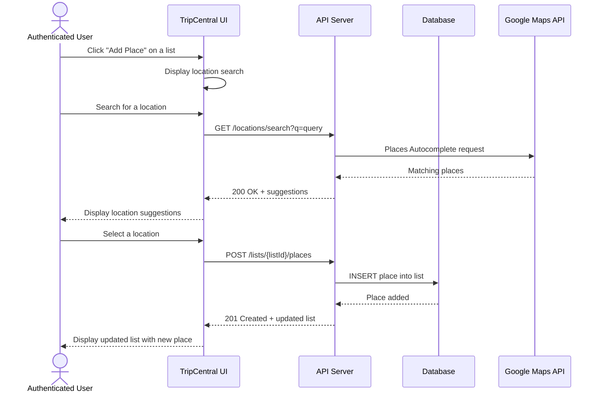
```mermaid
sequenceDiagram
    actor AuthUser as Authenticated User
    participant UI as TripCentral UI
    participant API as API Server
    participant DB as Database
    participant GMaps as Google Maps API

    AuthUser->>UI: Click "Add Place" on a list
    UI->>UI: Display location search
    AuthUser->>UI: Search for a location
    UI->>API: GET /locations/search?q=query
    API->>GMaps: Places Autocomplete request
    GMaps-->>API: Matching places
    API-->>UI: 200 OK + suggestions
    UI-->>AuthUser: Display location suggestions

    AuthUser->>UI: Select a location
    UI->>API: POST /lists/{listId}/places
    API->>DB: INSERT place into list
    DB-->>API: Place added
    API-->>UI: 201 Created + updated list
    UI-->>AuthUser: Display updated list with new place
```

---

### 13. Manage List Sections

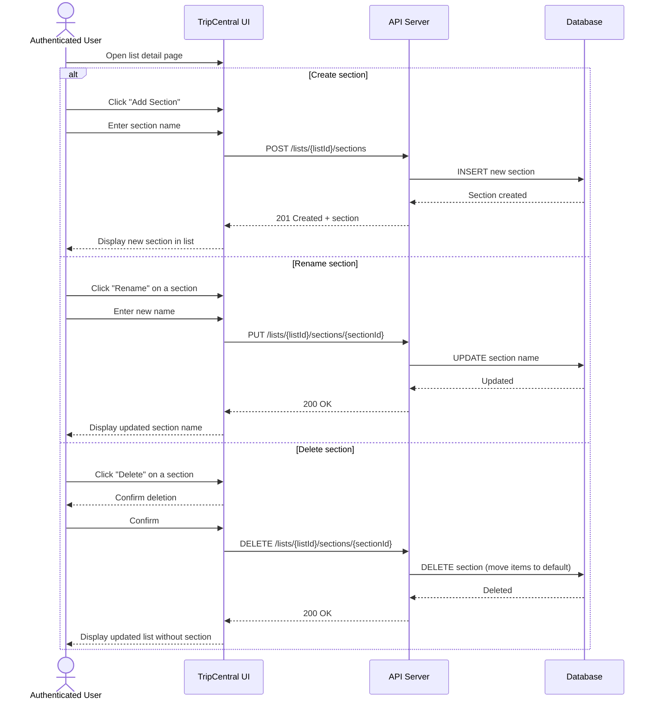
```mermaid
sequenceDiagram
    actor AuthUser as Authenticated User
    participant UI as TripCentral UI
    participant API as API Server
    participant DB as Database

    AuthUser->>UI: Open list detail page

    alt Create section
        AuthUser->>UI: Click "Add Section"
        AuthUser->>UI: Enter section name
        UI->>API: POST /lists/{listId}/sections
        API->>DB: INSERT new section
        DB-->>API: Section created
        API-->>UI: 201 Created + section
        UI-->>AuthUser: Display new section in list
    else Rename section
        AuthUser->>UI: Click "Rename" on a section
        AuthUser->>UI: Enter new name
        UI->>API: PUT /lists/{listId}/sections/{sectionId}
        API->>DB: UPDATE section name
        DB-->>API: Updated
        API-->>UI: 200 OK
        UI-->>AuthUser: Display updated section name
    else Delete section
        AuthUser->>UI: Click "Delete" on a section
        UI-->>AuthUser: Confirm deletion
        AuthUser->>UI: Confirm
        UI->>API: DELETE /lists/{listId}/sections/{sectionId}
        API->>DB: DELETE section (move items to default)
        DB-->>API: Deleted
        API-->>UI: 200 OK
        UI-->>AuthUser: Display updated list without section
    end
```

---

### 14. Reorder List Items

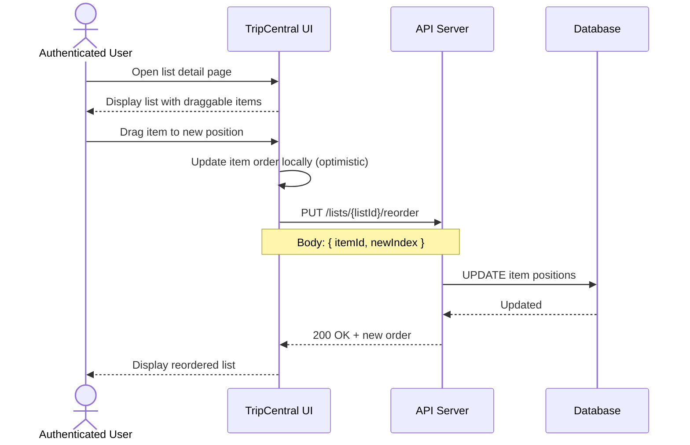
```mermaid
sequenceDiagram
    actor AuthUser as Authenticated User
    participant UI as TripCentral UI
    participant API as API Server
    participant DB as Database

    AuthUser->>UI: Open list detail page
    UI-->>AuthUser: Display list with draggable items
    AuthUser->>UI: Drag item to new position
    UI->>UI: Update item order locally (optimistic)
    UI->>API: PUT /lists/{listId}/reorder
    Note over UI,API: Body: { itemId, newIndex }
    API->>DB: UPDATE item positions
    DB-->>API: Updated
    API-->>UI: 200 OK + new order
    UI-->>AuthUser: Display reordered list
```

---

## Collaboration & Community

### 15. Invite User to Collaborate

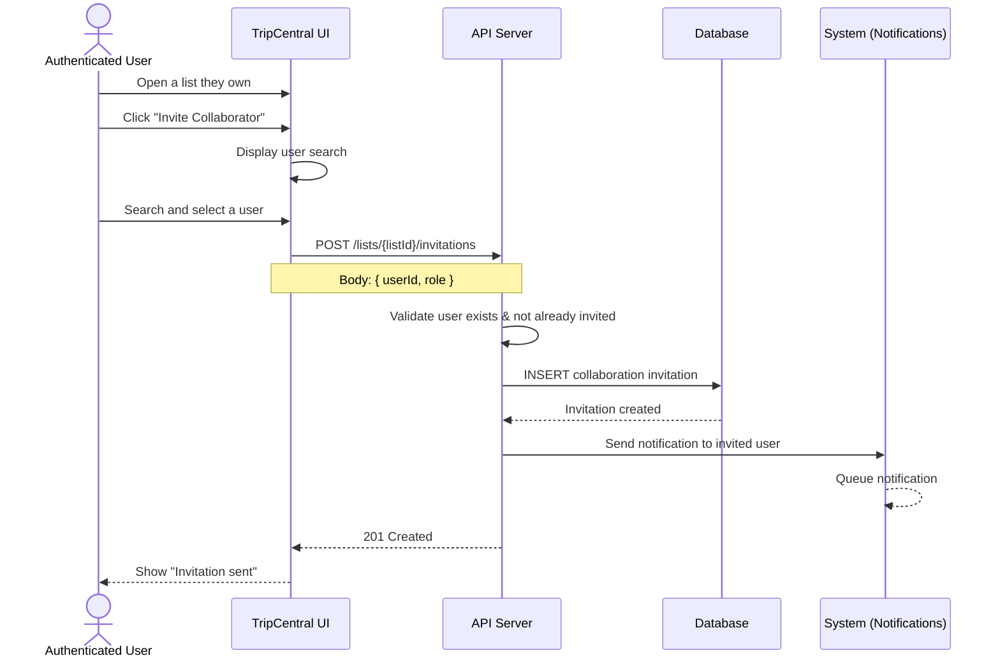
```mermaid
sequenceDiagram
    actor AuthUser as Authenticated User
    participant UI as TripCentral UI
    participant API as API Server
    participant DB as Database
    participant System as System (Notifications)

    AuthUser->>UI: Open a list they own
    AuthUser->>UI: Click "Invite Collaborator"
    UI->>UI: Display user search
    AuthUser->>UI: Search and select a user
    UI->>API: POST /lists/{listId}/invitations
    Note over UI,API: Body: { userId, role }
    API->>API: Validate user exists & not already invited
    API->>DB: INSERT collaboration invitation
    DB-->>API: Invitation created
    API->>System: Send notification to invited user
    System-->>System: Queue notification
    API-->>UI: 201 Created
    UI-->>AuthUser: Show "Invitation sent"
```

---

### 16. Chat with Collaborators

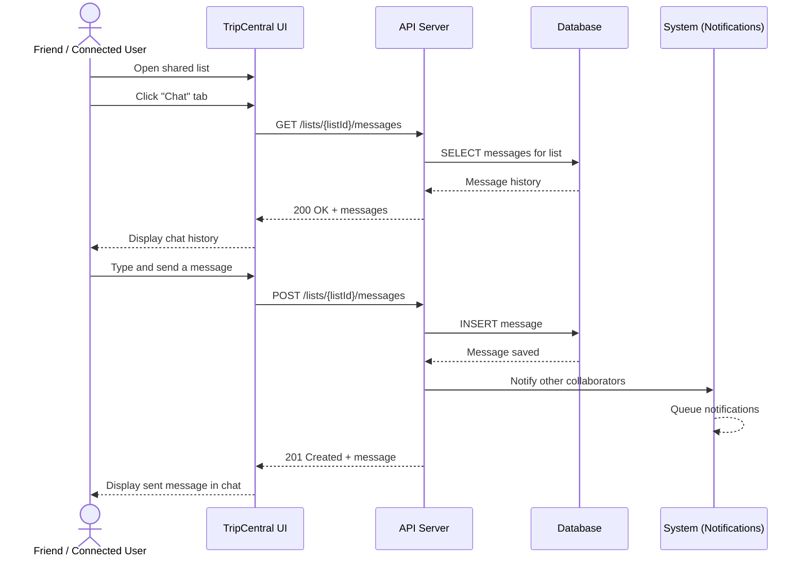
```mermaid
sequenceDiagram
    actor Friend as Friend / Connected User
    participant UI as TripCentral UI
    participant API as API Server
    participant DB as Database
    participant System as System (Notifications)

    Friend->>UI: Open shared list
    Friend->>UI: Click "Chat" tab
    UI->>API: GET /lists/{listId}/messages
    API->>DB: SELECT messages for list
    DB-->>API: Message history
    API-->>UI: 200 OK + messages
    UI-->>Friend: Display chat history

    Friend->>UI: Type and send a message
    UI->>API: POST /lists/{listId}/messages
    API->>DB: INSERT message
    DB-->>API: Message saved
    API->>System: Notify other collaborators
    System-->>System: Queue notifications
    API-->>UI: 201 Created + message
    UI-->>Friend: Display sent message in chat
```

---

### 17. Propose Changes

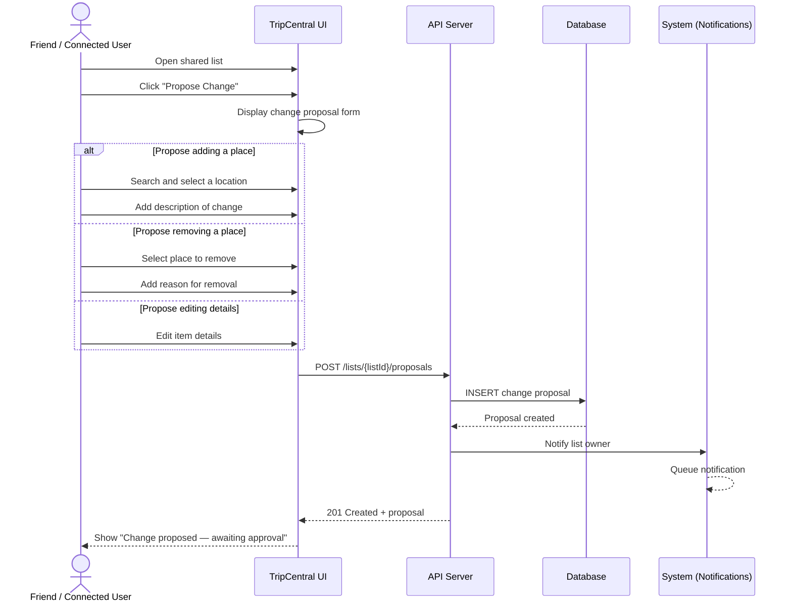
```mermaid
sequenceDiagram
    actor Friend as Friend / Connected User
    participant UI as TripCentral UI
    participant API as API Server
    participant DB as Database
    participant System as System (Notifications)

    Friend->>UI: Open shared list
    Friend->>UI: Click "Propose Change"
    UI->>UI: Display change proposal form

    alt Propose adding a place
        Friend->>UI: Search and select a location
        Friend->>UI: Add description of change
    else Propose removing a place
        Friend->>UI: Select place to remove
        Friend->>UI: Add reason for removal
    else Propose editing details
        Friend->>UI: Edit item details
    end

    UI->>API: POST /lists/{listId}/proposals
    API->>DB: INSERT change proposal
    DB-->>API: Proposal created
    API->>System: Notify list owner
    System-->>System: Queue notification
    API-->>UI: 201 Created + proposal
    UI-->>Friend: Show "Change proposed — awaiting approval"
```

---

### 18. Approve / Reject Changes

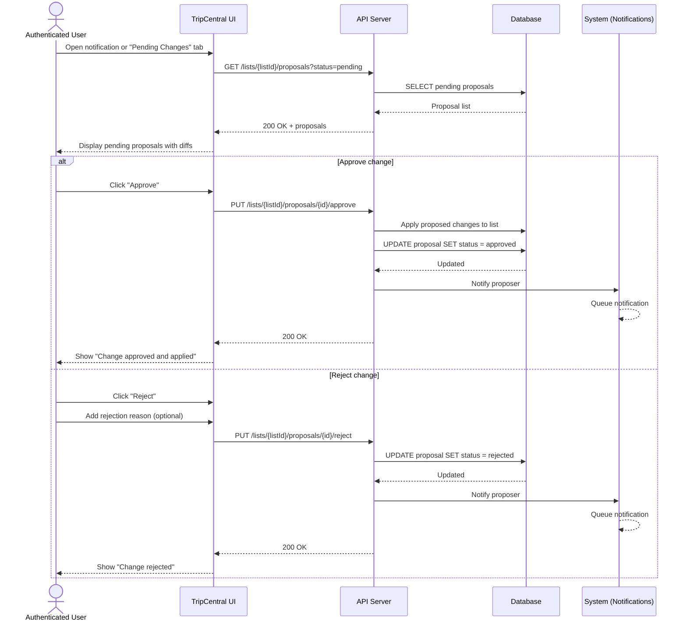
```mermaid
sequenceDiagram
    actor AuthUser as Authenticated User
    participant UI as TripCentral UI
    participant API as API Server
    participant DB as Database
    participant System as System (Notifications)

    AuthUser->>UI: Open notification or "Pending Changes" tab
    UI->>API: GET /lists/{listId}/proposals?status=pending
    API->>DB: SELECT pending proposals
    DB-->>API: Proposal list
    API-->>UI: 200 OK + proposals
    UI-->>AuthUser: Display pending proposals with diffs

    alt Approve change
        AuthUser->>UI: Click "Approve"
        UI->>API: PUT /lists/{listId}/proposals/{id}/approve
        API->>DB: Apply proposed changes to list
        API->>DB: UPDATE proposal SET status = approved
        DB-->>API: Updated
        API->>System: Notify proposer
        System-->>System: Queue notification
        API-->>UI: 200 OK
        UI-->>AuthUser: Show "Change approved and applied"
    else Reject change
        AuthUser->>UI: Click "Reject"
        AuthUser->>UI: Add rejection reason (optional)
        UI->>API: PUT /lists/{listId}/proposals/{id}/reject
        API->>DB: UPDATE proposal SET status = rejected
        DB-->>API: Updated
        API->>System: Notify proposer
        System-->>System: Queue notification
        API-->>UI: 200 OK
        UI-->>AuthUser: Show "Change rejected"
    end
```

---

### 19. Make List Public

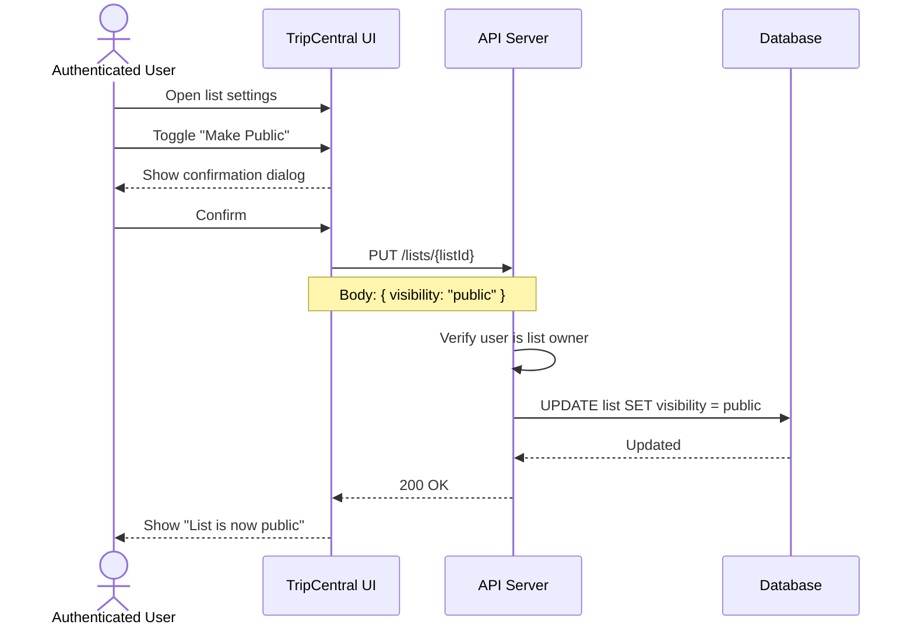
```mermaid
sequenceDiagram
    actor AuthUser as Authenticated User
    participant UI as TripCentral UI
    participant API as API Server
    participant DB as Database

    AuthUser->>UI: Open list settings
    AuthUser->>UI: Toggle "Make Public"
    UI-->>AuthUser: Show confirmation dialog
    AuthUser->>UI: Confirm
    UI->>API: PUT /lists/{listId}
    Note over UI,API: Body: { visibility: "public" }
    API->>API: Verify user is list owner
    API->>DB: UPDATE list SET visibility = public
    DB-->>API: Updated
    API-->>UI: 200 OK
    UI-->>AuthUser: Show "List is now public"
```

---

### 20. Browse Public Lists

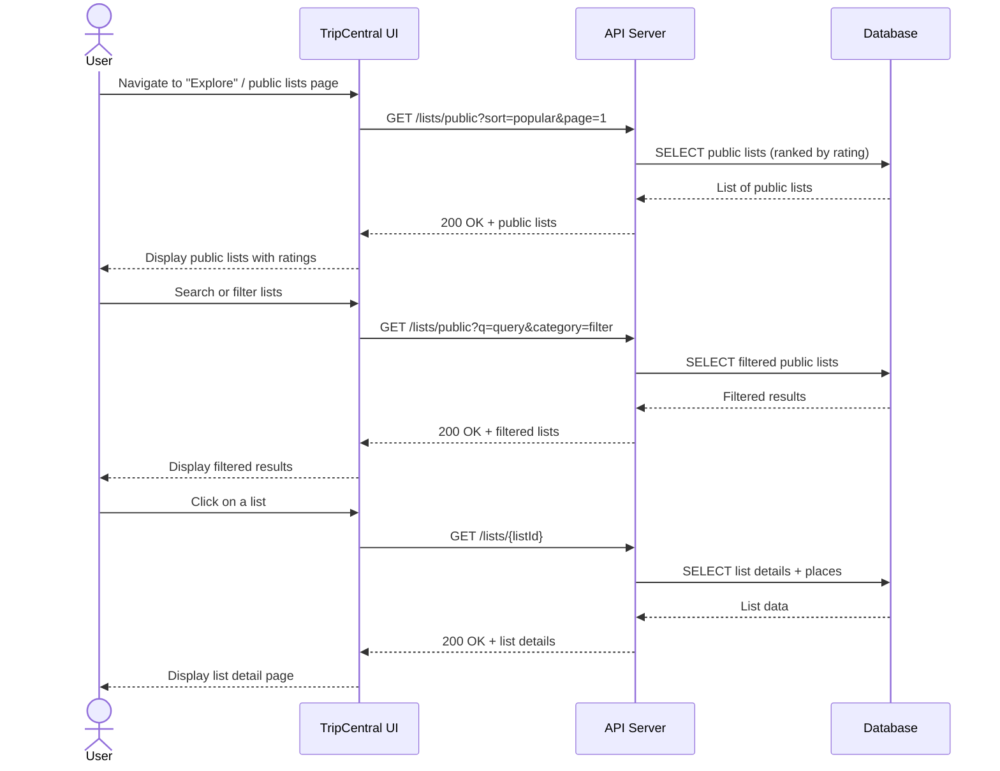
```mermaid
sequenceDiagram
    actor User
    participant UI as TripCentral UI
    participant API as API Server
    participant DB as Database

    User->>UI: Navigate to "Explore" / public lists page
    UI->>API: GET /lists/public?sort=popular&page=1
    API->>DB: SELECT public lists (ranked by rating)
    DB-->>API: List of public lists
    API-->>UI: 200 OK + public lists
    UI-->>User: Display public lists with ratings

    User->>UI: Search or filter lists
    UI->>API: GET /lists/public?q=query&category=filter
    API->>DB: SELECT filtered public lists
    DB-->>API: Filtered results
    API-->>UI: 200 OK + filtered lists
    UI-->>User: Display filtered results

    User->>UI: Click on a list
    UI->>API: GET /lists/{listId}
    API->>DB: SELECT list details + places
    DB-->>API: List data
    API-->>UI: 200 OK + list details
    UI-->>User: Display list detail page
```

---

### 21. Rate a List

```mermaid
sequenceDiagram
    actor AuthUser as Authenticated User
    participant UI as TripCentral UI
    participant API as API Server
    participant DB as Database

    AuthUser->>UI: View a public list
    AuthUser->>UI: Click star rating (1-5)
    UI->>API: POST /lists/{listId}/ratings
    Note over UI,API: Body: { rating: 4 }
    API->>API: Validate rating (1–5)
    API->>DB: UPSERT rating (one per user per list)
    DB-->>API: Rating saved
    API->>DB: SELECT AVG(rating) for list
    DB-->>API: New aggregate rating
    API-->>UI: 200 OK + updated average rating
    UI-->>AuthUser: Display updated rating
```

---

### 22. Submit Place Review

```mermaid
sequenceDiagram
    actor AuthUser as Authenticated User
    participant UI as TripCentral UI
    participant API as API Server
    participant DB as Database

    AuthUser->>UI: Open location detail page
    AuthUser->>UI: Click "Write a Review"
    UI->>UI: Display review form
    AuthUser->>UI: Enter rating (1-5), title, and review text
    UI->>API: POST /locations/{locationId}/reviews
    Note over UI,API: Body: { rating, title, text }
    API->>API: Validate input
    API->>DB: INSERT review
    DB-->>API: Review saved
    API->>DB: SELECT AVG(rating) for location
    DB-->>API: Updated aggregate rating
    API-->>UI: 201 Created + review + updated rating
    UI-->>AuthUser: Display review and updated rating on page
```

---

## Actors Reference

| Actor | Appears In Diagrams |
|-------|-------------------|
| **Guest** | Sign Up, Verify Email |
| **User** (Guest or Auth) | Log In, View Location Details, Browse Public Lists |
| **Authenticated User** | View/Edit Profile, Search Users, Receive Notifications, Search Locations, Create List, Delete List, Add Place to List, Manage List Sections, Reorder List Items, Invite User to Collaborate, Approve/Reject Changes, Make List Public, Rate a List, Submit Place Review |
| **Friend / Connected User** | Accept/Reject Invitation, Receive Notifications, Chat with Collaborators, Propose Changes |
| **System** | Sign Up (email), Verify Email, Receive Notifications, Invite User to Collaborate, Chat with Collaborators, Propose Changes, Approve/Reject Changes |
