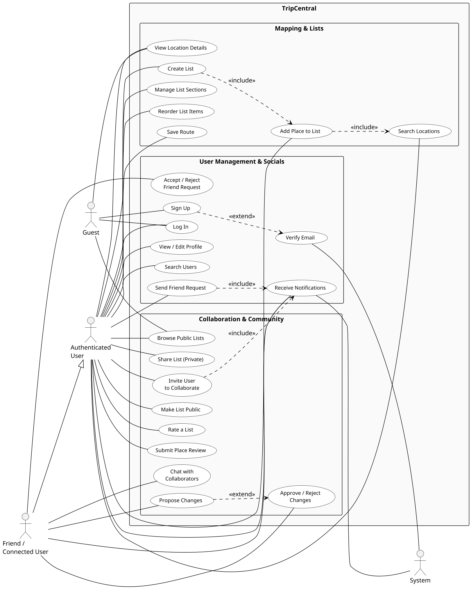

# TripCentral — Use Case Diagram

## Rendering Instructions

The diagram below is written in **PlantUML** syntax.

**Free websites to render the diagram:**

| Website | URL |
|---------|-----|
| **PlantUML Online Server** | <https://www.plantuml.com/plantuml/uml> |
| **PlantText** | <https://www.planttext.com> |

Copy the entire code block from the [PlantUML Code](#plantuml-code) section, paste it into
any of the websites above, and click **Submit / Render** to get the diagram image.

---

## Actors

| # | Actor | Type | Description |
|---|-------|------|-------------|
| 1 | **Guest** | Primary | An unauthenticated visitor who can browse public lists and view location details but cannot create content or connect with users. |
| 2 | **Authenticated User** | Primary | A registered, email-verified user who can create lists, add locations, connect with friends, submit reviews, and share lists. |
| 3 | **Friend / Connected User** | Secondary | An authenticated user who has an approved connection with another user. Can view shared non-public lists, collaborate, and receive notifications. |
| 4 | **System** | Automated | The backend system that triggers email verification, dispatches notifications, aggregates reviews, and ranks public lists. |

---

## Use Cases

### User Management & Socials
1. Sign Up
2. Log In
3. Verify Email (extends Sign Up — triggered by System)
4. View / Edit Profile
5. Search Users
6. Send Friend Request
7. Accept / Reject Friend Request
8. Receive Notifications

### Mapping & Lists
9. Search Locations (Google Maps)
10. View Location Details
11. Create List
12. Add Place to List
13. Manage List Sections
14. Reorder List Items
15. Save Route

### Collaboration & Community
16. Share List (Private)
17. Invite User to Collaborate
18. Chat with Collaborators
19. Propose Changes
20. Approve / Reject Changes
21. Make List Public
22. Browse Public Lists
23. Rate a List
24. Submit Place Review

---

## PlantUML Code

---

## How to Read the Diagram

- **Actor placement** — Primary and secondary human actors (*Guest*,
  *Authenticated User*, *Friend*) are on the **left**; the automated *System*
  actor is on the **right**.  This keeps association lines flowing in one
  direction and avoids arrow collisions.
- **Solid lines** from an actor to an oval (use case) indicate that the actor
  can initiate or participate in that use case.
- **`<<include>>`** (dashed arrow) means the base use case *always* triggers the
  included use case (e.g., "Create List" always includes "Add Place to List").
- **`<<extend>>`** (dashed arrow) means the extending use case *optionally*
  triggers under certain conditions (e.g., "Sign Up" may extend to
  "Verify Email" when triggered by the System).
- **Generalization arrow** (solid triangle) from *Friend* to *Authenticated User*
  means a Friend inherits all capabilities of an Authenticated User.
- **Printing** — The diagram is scaled at 1.5× for clear A3 printing.  When
  rendering via PlantUML Online or PlantText, export as **SVG** or **PNG** for
  the best print quality.
